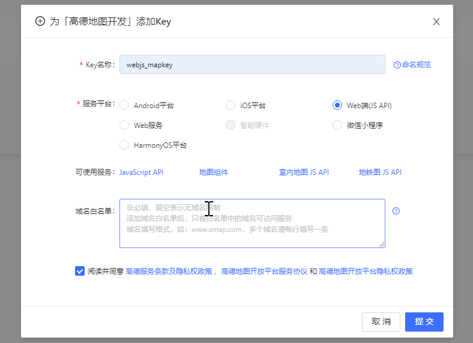

| Key 名称     | Key                              | 绑定服务 |
| ------------ | -------------------------------- | -------- |
| webjs_mapkey | d3fcaebb2ce850826758ed089c9a8132 | Web 端   |

## 配置

### global config

\$amapKey:String

\$amapCenter:[Number, Number]

### props

version

plugins:[string]

options:Object

> options 中的配置 会覆盖 global config 中已定义的同意义配置参数

实例：

```js
Vue.prototype.$amapKey = "d3fcaebb2ce850826758ed089c9a8132";
```

## function

### [事件](https://lbs.amap.com/api/jsapi-v2/documentation#event)

```js
// 声明点击事件的回调函数
function onClick(e) {
  console.log(e);
}
// 给地图实例绑定点击事件 onClick
map.on("click", onClick);

// 移除地图实例的 onClick 事件绑定
map.off("click", onClick);

// 清除地图实例上的所有 click 事件绑定
map.clearEvents("click");

// 覆盖物绑定鼠标移动事件
polygon.on("mousemove", console.log);

// 覆盖物绑定事件判断
polygon.hasEvents("mousemove", console.log);
```

```js
// 地图、图层、覆盖物等
 on(type, function, context, once)
 off(type, function, context)
 hasEvents(type, function, context)
 clearEvents(type)
 emit(type, data) //模拟触发当前实例的某个事件
```
